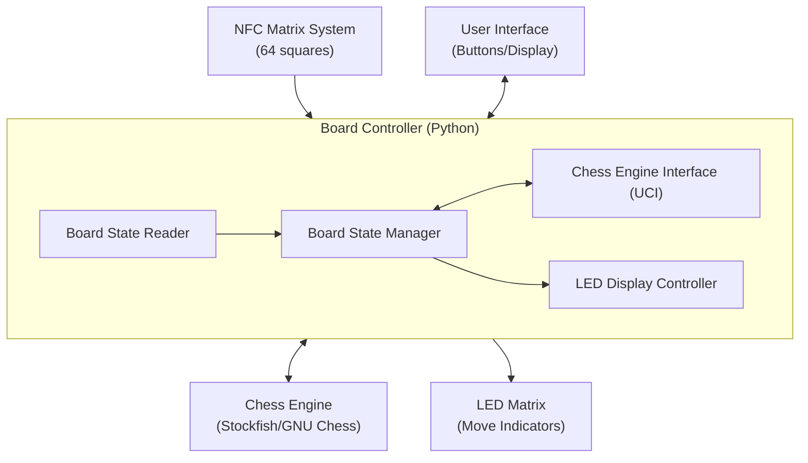

# michess

An open-source NFC-based smart chess board powered by a Raspberry Pi. Place any piece on any square and the board knows exactly what it is and where it is - no setup routine, no special starting position required.

The board uses LEDs embedded behind a wood veneer to indicate the chess engine's moves, creating a clean physical interface for playing against a computer opponent.

---

## Features

- **Full piece identification** - NFC tags in each piece base, detected by a matrix of antennas under the board
- **Arbitrary position recognition** - pick up mid-game, set up a puzzle, analyse a position
- **LED move indicators** - subtle lighting behind the veneer shows the engine's chosen move
- **Stockfish integration** - plays via the standard UCI chess engine interface
- **Open design** - all hardware designs and software are freely available

---

## How It Works

64 NFC antennas sit beneath the board, one per square, managed by a hierarchical multiplexer system. A Raspberry Pi 4 scans the full board in under 2 seconds, determines the game state, passes it to Stockfish, and lights up the appropriate squares.

---

## Project Status

> **Early development** - currently prototyping the NFC matrix on a 2×2 test board.

---

## Licences

This project uses different licences for different parts:

| Part | Licence |
|---|---|
| Software | [GPL-3.0](https://www.gnu.org/licenses/gpl-3.0.html) |
| Hardware designs | [CERN-OHL-S v2](https://ohwr.org/cern_ohl_s_v2.txt) |
| Documentation | [CC BY-SA 4.0](https://creativecommons.org/licenses/by-sa/4.0/) |

You are free to use, modify, and build on michess for any purpose - including building your own board - but you must share any changes under the same terms. Commercial use is permitted, but derived works cannot be closed source.
