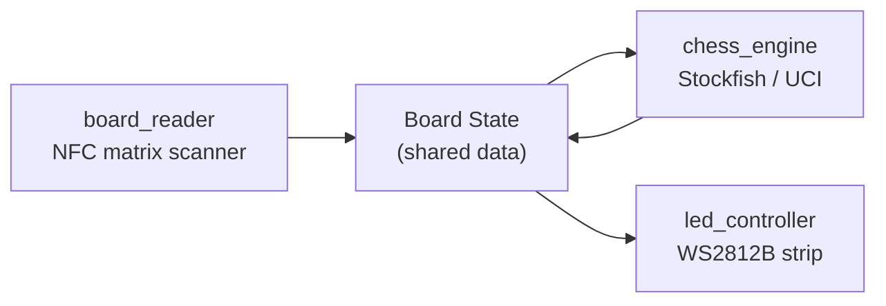

# Software

The michess software stack is written in Python and runs on the Raspberry Pi. It is split into three modules that communicate through a shared board state.

---

## Architecture



---

## Modules

### `software/board_reader/`

Scans the 64-square NFC matrix by cycling through the 8 PN532 reader modules and their multiplexed antennas. Returns a snapshot of which NFC tag UIDs are present on which squares.

**Key responsibilities:**

- Drive the CD74HC4067 multiplexers via GPIO
- Poll each PN532 over I²C / SPI
- Map UID → piece identity (from a pre-configured tag registry)
- Emit a `BoardSnapshot` on every scan cycle

### `software/chess_engine/`

Wraps a UCI-compatible chess engine (Stockfish by default, GNU Chess as a fallback). Accepts a board position and returns the engine's chosen move.

**Key responsibilities:**

- Manage the engine subprocess via `python-chess`
- Convert `BoardSnapshot` to a FEN string
- Send position + `go` commands, parse `bestmove` response
- Track game state (whose turn, move history, check/checkmate)

### `software/led_controller/`

Drives the WS2812B LED strip. Listens for display events (move suggestion, check, illegal move) and updates the LEDs accordingly.

**Key responsibilities:**

- Map square coordinates to LED indices
- Animate from-square and to-square highlights
- Flash patterns for check, checkmate, and illegal moves
- Interface with `rpi_ws281x`

---

## Dependencies

| Package | Purpose |
|---|---|
| `python-chess` | Chess logic, FEN, UCI protocol |
| `rpi_ws281x` | WS2812B LED control |
| `adafruit-circuitpython-pn532` | PN532 NFC reader driver |
| `RPi.GPIO` | Multiplexer pin control |

Install all dependencies with:

```bash
pip install -r requirements.txt
```

---

## Running

```bash
# Activate the virtual environment first
source venv/bin/activate

# Run with physical hardware
python software/main.py

# Run in simulated mode (no hardware required)
python software/main.py --simulate
```

---

## Testing

Tests live in `tests/`. Run the full suite with:

```bash
pytest
```

---

## Licences

All software is released under [GPL-3.0](https://www.gnu.org/licenses/gpl-3.0.html). Any modifications or software that incorporates this code must also be released under GPL-3.0.
